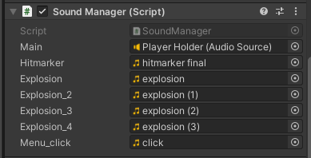

# Prototype FPS

## Table of Contents

- [Overview](#overview)
- [Features](#features)
  - [Core Gameplay Mechanics](#core-gameplay-mechanics)
  - [Advanced Crosshair System](#advanced-crosshair-system)
  - [Player Kinematics and Input Handling](#player-kinematics-and-input-handling)
  - [Weapon Framework](#weapon-framework)
  - [UI & System Management](#ui--system-management)
  - [AI & Target Practice Environment](#ai--target-practice-environment)
- [Demos (Video previews)](#demos)

## Overview

This project represents a prototype first-person shooter (FPS) game developed within the **Unity** engine utilizing the **Universal Render Pipeline (URP)**. The game is designed with modularity in mind, allowing for easy customization and expansion.

## Features

### Core Gameplay Mechanics

- **Killfeed System**: Provides real-time elimination notifications with corresponding weapon icons and player identifiers.

| Preview |
|---------|
|  |

- **Diagnostic Overlay**: Offers in-depth performance analytics, including:
  - Frame rate monitoring
  - Frame time computation
  - Current GPU
  - Current game engine API
  - Resolution details
  - Threading type

| Preview |
|---------|
|  |

### Advanced Crosshair System

- **Modular Crosshair System**: Adjustable dimensions and real-time customization.
- **Dynamic Crosshair Adaptation**: Synchronizes crosshair movement with weapon recoil, optionally enabled.
- **Crosshair Customization Interface**: Features a dropdown menu for selecting predefined crosshair styles.
- **Hitmarker Mechanics**:
  - Real-time hitmarker overlay fades upon successful target engagement.
  - Debug functionality for spatially visualizing hit area on enemy models.

### Player Kinematics and Input Handling

- **Highly Configurable Movement System**:
  - Adjustable walk speed
  - Sprinting velocity control
  - Jump height calibration
  - Half-Life-style bunny hopping implementation
  - Gravity modification parameters
  - Customizable ground mask

| Script preview |
|---------|
|  |

- **Input Management**: Standardized input processing framework.
  - Unprocessed Windows raw input for precise aim control (disables mouse acceleration).

| Script preview |
|---------|
|  |
|  |

- **Head Bobbing Simulation**: Adjustable amplitude and frequency for immersive movement dynamics.

| Script preview |
|---------|
|  |

### Weapon Framework

- **Modular Firearm System**: Extensible weapon scripting with minimal integration overhead.
- **Weapon Sway Model**:
  - Smooth motion blending for camera responsiveness
  - Adjustable parameters including smoothing and sway intensity multipliers

| Script preview |
|---------|
|  |

- **Firearm Attributes**:
  - Configurable hitmarker activation logic
  - Ray-traced projectile trajectory visualization
  - Semi-/fully automatic firing toggle
  - Integrated muzzle flash effects
  - Parametric damage scaling based on shot range
  - Adjustable projectile origin point
  - Assignable audio profiles for gunfire events
  - Killfeed-linked weapon imagery
  - Tunable fire rate settings
- **Recoil Mechanism**:
  - Precomputed spray patterns
  - Optional random deviation for non-deterministic shot distribution
  - Adjustable visual recoil snappiness and recovery velocity

| Script preview |
|---------|
|  |

### UI & System Management

- **Comprehensive Menu System**: Represents multiple user interface elements:
  - Real-time diagnostic overlay
  - FPS counter display
  - Game settings panel
  - Pause menu functionality
  - Crosshair configuration interface

| Script preview |
|---------|
|  |

- **Sound Manager**: Manages all in-game sound effects and audio playback:
  - Assignable audio clips for various events.
  - Configurable volume scaling and attenuation based on in-game environment.
  - 3D positional sound effects for improved immersion.

| Script preview |
|---------|
|  |

### AI & Target Practice Environment

- **Adaptive Enemy Scripting**:
  - Configurable health values
  - Immunity parameter toggle
- **Training Mode**:
  - Target dummy exhibiting variable movement speeds
  - Modifiable pathing nodes (A/B positional assignments via transform components)
  - Optional randomized trajectory oscillations (RNG) to introduce unpredictability

| Script preview |
|---------|
|  |
|  |

### Demos

todo.
